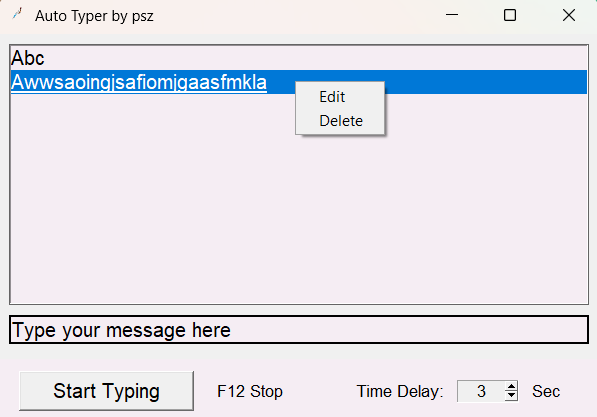

# Typi
Typi is an automated typing app made with Python's tkinter, typing predefined messages at set intervals.
(My in-game name is psz, which is why it's in the title of the GUI.)

## Features
- Add, Edit, and Delete Sentences: Manage a list of sentences to be typed automatically.
- Custom Time Delay: Set a delay (in seconds) between typing messages.
- Hotkey Support: Stop the typing process with the F12 key.

## Clarification
The script will wait for 3 seconds after starting before typing begins, allowing you to focus on the target window.
To prevent accidental actions, the input field is disabled while typing is active
